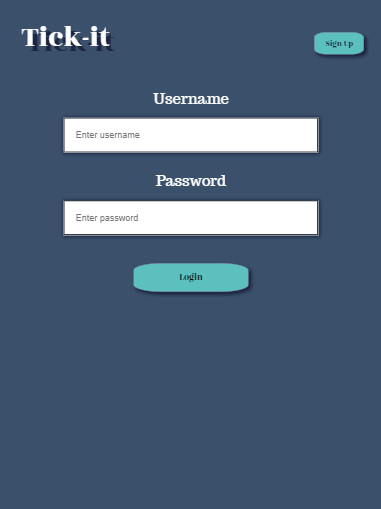
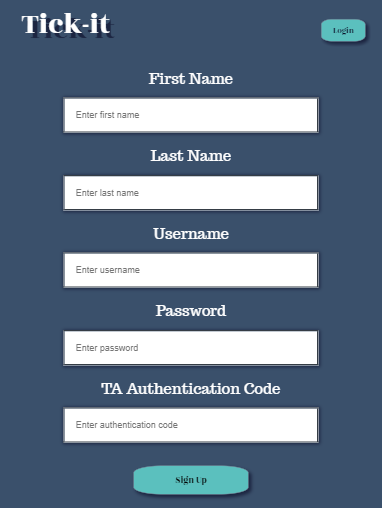
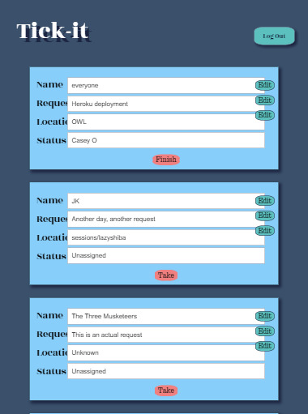

# Title: Tick-it

## Description <br/> 
This App was brainstormed up while we, as students, sat in a slack channel waiting for a response on a heavy request day, but not really knowing when a response would come, or what our standing was. Enter in Tick-it, the web app that allows Thinkful TA's and students to stay organized on a transparent platform. TA's are able to keep track of requests submitted by students who need assistance with a variety of coding challenges, while students are able to keep track of the requests they have submitted and where they line up on the queue. 

## Technology Used <br/>
**FrontEnd**: HTML, CSS, Javascript, React<br/>
**BackEnd**: NodeJS, Express, MongoDB, Mongoose, Mlab<br/>
**Deployment**: Heroku, Travis <br/> 

## Documentation of API <br/>
* **GET** https://tick-it-jk.herokuapp.com/api/tickets <br/>
  * This allows you to get all the tickets in the database <br/>
  * This is used to display all the tickets in the frontend persistently</br>
* **POST** https://tick-it-jk.herokuapp.com/api/tickets <br/>
  * This allows you to post a ticket into the database <br/>
  * This is used to allow student users (who do not need to log in) to submit a ticket
* **PUT** https://tick-it-jk.herokuapp.com/api/tickets/:id/status <br/>
  * This allows TA users that are logged in to update a ticket in the database <br/>
  * This is used to allow TA users to update the status of a ticket <br/>
* **DELETE** https://tick-it-jk.herokuapp.com/api/tickets/:id <br/>
  * This allows you to delete a ticket from the database <br/>
  * This is used to allow student users to delete the ticket if they don't need help <br/>
  * This is used to allow TA users to delete the ticket once they are finished with it <br/>
* **GET** https://tick-it-jk.herokuapp.com/api/users/:username <br/>
  * This allows TA users that are logged in to get their username and fullName from the database <br/>
  * This is used to allow us to store the username and fullname into a localStorage once the TA logs in <br/>
* **POST** https://tick-it-jk.herokuapp.com/api/users <br/>
  * This allows you to add a user into the database <br/>
  * This is used to allow people to sign up as a TA user <br/>

### API still needs to be used in Frontend <br/>
* **PUT** https://tick-it-jk.herokuapp.com/api/tickets/:id <br/>
  * This allows you to update a ticket's fields into the database <br/>
  * This allows student users to edit their request description, group name, or location <br/>

## How To Use our code <br/>
* Fork it to your Repo
* Git clone the Repo link
* Move into the project directory: `cd ~/YOUR_PROJECTS_DIRECTORY/YOUR_PROJECT_NAME`
* Run `npm install` in the terminal => install all the dependencies
* Make sure MongoDB is installed
* Run `mongod` in the terminal => to run the mongodb server 
* Run `npm run dev` in the terminal => to run the client and backend server
* Run the development task: `npm run dev`
    * Starts a server running at http://localhost:8080
    * Automatically rebuilds when any of your files change

## Installing dependencies

Client-side dependencies should be installed into the `client` directory:

```
cd ~/YOUR_PROJECTS_DIRECTORY/YOUR_PROJECT_NAME/client
npm install --save dependency-name
```

Server-side dependencies should be installed into the `server` directory:

```
cd ~/YOUR_PROJECTS_DIRECTORY/YOUR_PROJECT_NAME/server
npm install --save dependency-name
```

## Screenshots <br/>
#### Home Screen <br/>
When you go to our website, you will be directed to our Ticket Submission Page <br/>
 <br/>

#### Ticket list <br/>
When you submit a ticket (no blank values), you will be directed to our Ticket List Page. Clicking on submit new request or Tick-it will lead you back to the Home Screen <br/>
 <br/>

#### Login <br/>
When you click TA Login Or Signup in the Home Screen, you will be directed to the Login Page <br/>
 <br/>

#### Sign Up <br/>
When you click on the sign up on the login page, you will be directed to the Sign Up Page <br/>
 <br/>

#### TA Screen <br/>
When you log in from the Login page, you will go to the TA screen. When you go to any other page while you are logged in, you will be redirected to the TA screen. When you click logout, you will go back to the login screen. <br/>
 <br/>

